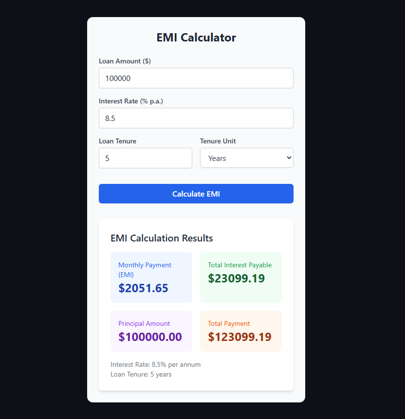

# EMI Calculator Pro

  
*Calculate loan payments with precision*

Live Demo: [emi-calculator-pro.vercel.app](https://emi-calculator-pro.vercel.app)

## 🚀 Features

### 📝 Input Fields
- **Loan Amount** (e.g., $100,000)
- **Interest Rate** (e.g., 8.5% p.a.)
- **Loan Tenure** (e.g., 5)
- **Tenure Unit Toggle** (Years/Months)

### 📊 Results Display
| Calculation | Value |
|-------------|-------|
| Monthly Payment (EMI) | $2051.65 |
| Total Interest Payable | $23099.19 |
| Principal Amount | $100000.00 |
| Total Payment | $123099.19 |

**Summary**:  
8.5% interest rate | 5 years tenure

## 🛠️ Tech Stack
- **Framework**: Next.js (App Router)
- **Language**: TypeScript
- **Styling**: Tailwind CSS
- **Deployment**: Vercel

## 🏁 Quick Start

### Installation
```bash
# Clone the repository
git clone https://github.com/Alirazahaider/nextjs-emi-calculator.git

# Navigate to project directory
cd emi-calculator

# Install dependencies
npm install
